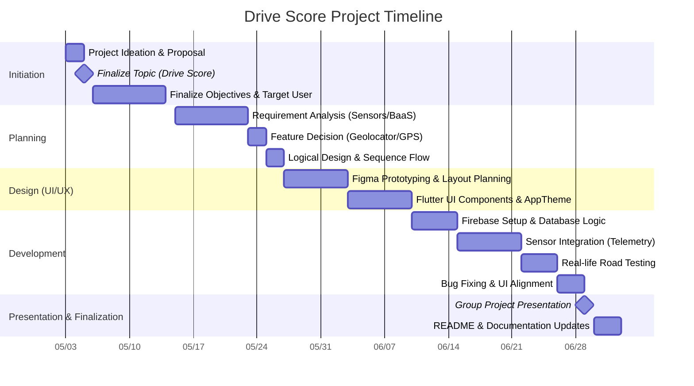

# Drive Score

## Group: Hawas Ice

## Team Members:
1. MUHAMMAD AZID BIN ROSLAN (2313133)
2. MUHAMMAD ADLI AMADI BIN JUNAIDI (2313381)
3. AMIRUL WAFI BIN ABDUL HAMID (2319281)
4. MUHAMMAD FARIS LUKMAN BIN MOHD JEFRI (2319375)

## Task Assigned:

Muhammad Adli Amadi bin Junaidi:
I've been assigned to connect the application with the firebase. I choose what what kind of data are important to be stored inside the Firestore. I also contribute to the deletion part of the sessions history. When user delete past session, the data inside the Firestore will also disappear. I also checked other teammates job to make sure what they're coding is working.

Muhammad Azid Bin Roslan:
I got tasked with helping Adli and Wafi on the backend calculation stuff for the application, mainly the score calculation logic, like how it reacts to unsafe driving behaviors such as speeding, hard braking, sudden acceleration, and sharp turns. I also tossed in some suggestions for threshold values, just to help the detection accuracy come out better, you know, more consistent. As the group leader, I keep track of who does what, I manage the task distribution and I monitor the project progress, even when things get a little messy. On top of that, I worked with Faris too, helping with the UI design part so the app feels simple, clean and user-friendly.

Amirul Wafi Bin Abdul Hamid:
I was assigned to develop the core functionalities of the app, mostly the sensor parts, like speed tracking, gyroscope reading, and acceleration detection. I also pushed work on the backend calculations together with Azid to make sure unsafe driving behaviors such as hard braking, harsh acceleration, sharp turns and bumps are caught accurately. On top of that, I did some real life testing to verify if the application really works in actual driving situations, not just in theory.

Muhammad Faris Lukman Bin Mohd Jefri:
I ve been assigned to help with the overall design and the frontend implementation of the application. I worked in tandem with Azid, to sort of craft the UI, and make sure it stays simple clean, user friendly, and not overwhelming. I also chipped in on getting the design moved into Flutter. After that I focused on debugging and running tests across the application flow, so each screen works correctly, without weird surprises.

## Project Ideation & Initiation
The title of this project is Drive Score, a monitoring system for driving behavior. This project idea came into our mind when there are a lot of accident cases that involves drivers that drive recklessly on the public road especially in Malaysia. This things happens probably because of their nature and habits of driving, which can be considered as selfish because they does not care about others whether their passengers or people outside of the car when driving. This habits sometimes are not noticeable by themselves, but it is can be noticed by others especially their passengers and it can cause other people to feel not comfortable when take a ride with them.

In order to proof them that their driving behavior is wrong and reckless, we decided to develop a mobile app that can help with detecting reckless behavior of driving such as hard braking, harsh acceleration, sharp turns, and hit a bump with high speed by using the sensors available inside the mobile phone. When the sensors detected those events, it will deduct the driving score. Our main focus is actually to encourage safety in driving and taking care of the well-being of the road users.

As for now, the preferred platform for the app is on Android OS, so that there is no need for high end phone in order to run this app. The target user is for those who want to improve their driving such as new drivers, daily commuters, delivery drivers, and parents monitoring family members. Plus, this system is probably available only on modern vehicles that provide advanced safety monitoring, but such systems are expensive and not accessible to everyone. So, we want to make sure everyone is able to have access to it since safety is always a priority. Although each team member was assigned specific responsibilities, the project was completed collaboratively. 

## Requirement Analysis & Planning
To ensure the application functions reliably as a real-time driving monitor, a thorough technical feasibility assessment was conducted. The system architecture leverages the Flutter framework to interface directly with the native hardware of the smartphone. On May 23, 2026, the team finalized the decision to utilize specific hardware tracking plugins, selecting geolocator to handle GPS-based speed and distance calculations, and sensors_plus to process accelerometer and gyroscope data for detecting sudden impacts and sharp turns. For the backend infrastructure, Firebase Firestore was selected as the Backend as a Service (BaaS) to manage cloud storage. This integration enables full CRUD (Create, Read, Update, Delete) operations, allowing driving sessions to be securely saved, retrieved, and deleted by the user. Additionally, to prevent data loss or application crashes during active driving sessions in areas with poor network coverage, Hive local storage was implemented to cache session data immediately before it is pushed to the Firestore database.

The application is built using Flutter, which inherently provides cross-platform compatibility for both Android and iOS devices. However, Android is prioritized as the primary platform to ensure high accessibility for users who may not possess high-end flagship smartphones. By utilizing stable, officially maintained plugins such as Firebase Core and Geolocator, the architecture ensures long-term support, allowing for straightforward compatibility updates and future feature enhancements.

The application was designed with a strict, linear screen navigation flow to prevent accidental data loss and reduce cognitive load on the driver. The user initiates the application on the HomeScreen, where they can view past session histories and interact with a prominent primary "Start" button. Upon initiating a drive, the system performs a location permission check before transitioning to the DrivingScreen. This active tracking interface explicitly locks native device back-swipes utilizing Flutter's PopScope widget, ensuring the session is not accidentally terminated by the user. The tracking concludes only when the user explicitly taps the "Stop" button, which transitions the flow to the ResultScreen. Here, the final computed score and event log are displayed. Finally, navigating back returns the user to the HomeScreen, which automatically triggers a state refresh to display the newly recorded session.

The project lifecycle was systematically planned and executed with clear milestones aligning with the logical design requirements. The initiation phase spanned from May 3 to May 14, 2026, during which initial ideation occurred and the "Drive Score" topic was officially finalized on May 5. Following this, the requirement analysis phase took place between May 15 and May 26, highlighted by the critical decision to utilize specific GPS plugins on May 23 and the establishment of the logical screen flow. From May 27 to June 9, the team shifted focus to UI/UX design, utilizing Figma for comprehensive layout prototyping, defining the centralized AppTheme colors, and engineering custom reusable Flutter widgets. The core development phase commenced on June 10 and concluded on June 28. This period encompassed Firebase integration, device telemetry algorithm implementation, UI consistency alignment, and real-life road testing. The project concludes with the presentation and finalization phase beginning on June 29, with dedicated time allocated until July 2 for incorporating post-presentation feedback into the official documentation.

## Project Design

During the design phase, our team kinda focused on making something clean, simple, and user friendly for Drive Score. Like, since this application is made for mobile devices, we planned the UI with mobile design principles in mind, especially for those smaller screen sizes. The big goal was to make sure users can reach important things pretty fast, for example the driving score, speed, distance, and any detected unsafe driving events, without the whole screen feeling crowded or, you know confusing.

For the user interface (UI), we used Flutter widgets such as Scaffold, AppBar, Container, Card, Text, and Icon to build the screens in a structured and responsive way. These widgets helped us create a consistent layout across multiple screens while maintaining good readability. We also implemented touch gestures and simple button interactions to make navigation smooth and easy for users.

For the user experience (UX), we kinda laid out the application flow in a way that feels simple and easy to grasp. Basically users only have to start the application, begin a driving session, let the system keep an eye on their driving behavior in real time , and then check the result summary once the trip is over. It’s that easy navigation, you know, it helps reduce confusion and pushes usability forward especially for people who are using it for the first time.

Consistency was also a big deal in our design process. We kept the same color theme, layout structure, and design pattern throughout the whole application. Like green is for safe driving, yellow stands for warning, and red is risky driving behavior. So it becomes easier for users to understand their performance at a glance, without thinking too much. We also made sure the fonts spacing, and card layouts stay consistent across all screens. This gives a more polished look and a calmer, comfortable user experience.

Even though Azid and Faris handled most of the design phase, everyone in the team still contributed ideas, and small suggestions that helped improve the overall design and usability of the application.

## Project Development
In the development phase, our team kinda focused on making sure all the proposed features and functionalities that were planned earlier were actually implemented. The main goal was to have Drive Score work like a real-time driving behavior monitoring system, which is able to spot unsafe driving activities and calculate the driving score properly, not just roughly.

The core functionalities that we successfully developed include starting a driving session, monitoring speed in real time , detecting unsafe driving events like hard braking, harsh acceleration, sharp turns, and also bump impacts, calculating driving scores, showing trip summaries, and saving the driving history. With these features, users can observe their driving habits more closely and go back to review past performance, to improve later on.

To keep the code quality in a good shape, the application was built using a modular approach. Each major part of the application was split into different folders and classes, so readability , maintainability, and debugging would be easier. Like , screens, widgets, services, and models were separated so the code stays more clean overall.

Example project structure:

lib/
 - ├── screens/
 - ├── widgets/
 - ├── services/
 - ├── models/
 - └── main.dart

This modular structure makes it, easier for team members to work on different parts of the application without causing conflicts, or sometimes at least not as much, in the codebase.

During development, several packages and plugins got integrated, to support the application features in a more tidy way. We used Firebase as the Backend as a Service (BaaS) platform, specifically Firestore, to store user driving session data and support CRUD operations. This lets driving records be created, then retrieved, later revised when needed, and ultimately removed from the database.

We also put in place logic checking and validation in order to reduce system errors and make the whole thing more reliable. For example, sensor readings are continuously validated, so abnormal or invalid values dont slip in and mess with the score calculation. Error checking was also done during Firebase operations, so failures related to data storage don’t end up happening unnoticed.

The main packages and plugins used include:

- firebase_core for connecting Flutter with Firebase
- cloud_firestore for database storage
- geolocator for location and speed tracking
- sensors_plus for accelerometer and gyroscope readings

For collaborative development our team mostly used GitHub as the main collaboration platform. GitHub let everyone push code, create branches, merge updates, and basically keep track of project progress in an efficient way. While doing branch and merge strategies, each person could work on their assigned tasks on its own first, before folding their code back into the main project branch.

In that phase, Adli ended up handling Firebase integration, plus database operations too. Wafi worked more on sensor-related functionalities, and also did real life testing in practice. Meanwhile Azid and Faris contributed to the backend logic, frontend integration, UI implementation, and even system testing. Even if responsibilities were spread out between members, the development phase itself got finished together with constant discussions , debugging sessions, and ongoing support from all team members.

##References
Flutter Documentation
Flutter. (n.d.). Flutter documentation. Retrieved June 29, 2026, from https://docs.flutter.dev

Firebase Documentation
Google. (n.d.). Firebase documentation. Retrieved June 29, 2026, from https://firebase.google.com/docs

Geolocator Package
Baseflow. (n.d.). Geolocator package. Retrieved June 29, 2026, from https://pub.dev/packages/geolocator

Sensors Plus Package
Flutter Community. (n.d.). Sensors Plus package. Retrieved June 29, 2026, from https://pub.dev/packages/sensors_plus

## Getting Started

This project is a starting point for a Flutter application.

A few resources to get you started if this is your first Flutter project:

- [Learn Flutter](https://docs.flutter.dev/get-started/learn-flutter)
- [Write your first Flutter app](https://docs.flutter.dev/get-started/codelab)
- [Flutter learning resources](https://docs.flutter.dev/reference/learning-resources)

For help getting started with Flutter development, view the
[online documentation](https://docs.flutter.dev/), which offers tutorials,
samples, guidance on mobile development, and a full API reference.
